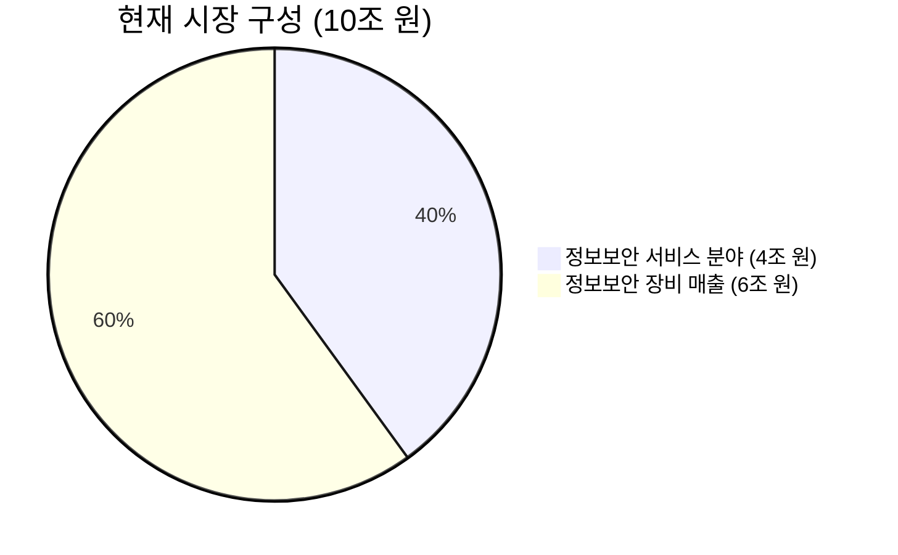
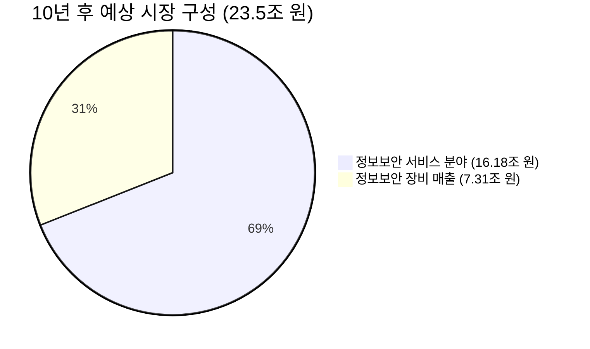

**시장 성장 예측 재정리**

---

**1. 현재 시장 상황**

- **전체 정보보안 시장 규모**: **10조 원**
  - **정보보안 서비스 분야**: **4조 원**
  - **정보보안 장비 매출**: **6조 원**

---

**2. 중소기업의 잠재력**

- **중소기업 수**: 약 **360만 개**, 전체 기업의 **99%** 차지
- **현재 중소기업 시장 참여율**: 낮은 편 (정보보안 도입율 약 **10~20%**)

---

**3. 클라우드 보안 시장 성장률**

- **글로벌 추세**: 클라우드 보안 시장 연평균 성장률 **15% 이상**

---

**4. 시장 성장 예측**

### **4-1. 5년 후 시장 규모 예측**

- **정보보안 서비스 분야 성장**
  - 현재 **4조 원**에서 연평균 **15%** 성장 시:
  \[
  \text{5년 후 서비스 시장 규모} = 4 \times (1 + 0.15)^5 \approx 4 \times 2.0114 = 8.0456 \text{조 원}
  \]
  - **서비스 분야는 약 8조 원**으로 성장

- **정보보안 장비 매출**
  - 온프레미스 장비 시장은 성장률이 낮아 **연평균 2%** 성장 가정:
  \[
  \text{5년 후 장비 시장 규모} = 6 \times (1 + 0.02)^5 \approx 6 \times 1.1041 = 6.6246 \text{조 원}
  \]
  - **장비 매출은 약 6.62조 원**으로 소폭 증가

- **총합**
  - **5년 후 전체 시장 규모**:
  \[
  8.0456 \text{조 원 (서비스)} + 6.6246 \text{조 원 (장비)} = 14.6702 \text{조 원}
  \]
  - **현재 대비 약 46.7% 성장**

### **4-2. 10년 후 시장 규모 예측**

- **정보보안 서비스 분야 성장**
  - 연평균 **15%** 성장 시:
  \[
  \text{10년 후 서비스 시장 규모} = 4 \times (1 + 0.15)^{10} \approx 4 \times 4.0456 = 16.1824 \text{조 원}
  \]
  - **서비스 분야는 약 16.18조 원**으로 성장

- **정보보안 장비 매출**
  - 연평균 **2%** 성장 시:
  \[
  \text{10년 후 장비 시장 규모} = 6 \times (1 + 0.02)^{10} \approx 6 \times 1.21899 = 7.3139 \text{조 원}
  \]
  - **장비 매출은 약 7.31조 원**으로 증가

- **총합**
  - **10년 후 전체 시장 규모**:
  \[
  16.1824 \text{조 원 (서비스)} + 7.3139 \text{조 원 (장비)} = 23.4963 \text{조 원}
  \]
  - **현재 대비 약 134.9% 성장 (두 배 이상 성장)**

---

**5. 각 변화 요소 설명**

1. **현재 시장은 10조 원**이며, 이 중 서비스 분야는 4조 원입니다.

2. **중소기업의 시장 참여**로 서비스 분야의 성장률이 높아져, 서비스 시장이 크게 확대됩니다.

3. **클라우드 시장은 연평균 15% 성장**하며, 이는 글로벌 추세와 일치합니다.

4. **기존 온프레미스에서 클라우드로의 이전**이 진행되면서, 서비스 분야의 성장에 기여합니다.

5. **결과적으로 시장 규모는 현재 10조 원에서 10년 내 약 23.5조 원으로 증가**합니다.

6. **각각의 변화는 다음과 같습니다**:
   - **서비스 분야**: 4조 원 → 16.18조 원 (약 4배 성장)
   - **장비 매출 분야**: 6조 원 → 7.31조 원 (소폭 증가)
   - **전체 시장 규모**: 10조 원 → 23.5조 원 (두 배 이상 성장)

---

**6. 요약**

- **시장 성장 요인**:
  - **중소기업의 클라우드 SaaS 도입 증가**
  - **기존 온프레미스 솔루션의 클라우드로의 전환**
  - **클라우드 보안 시장의 높은 연평균 성장률 (15%)**

- **시장 구성의 변화**:
  - **현재**: 서비스 40%, 장비 60%
  - **10년 후**: 서비스 약 69%, 장비 약 31%

---

**7. 결론**

- **10년 내로 정보보안 시장은 현재의 10조 원에서 약 23.5조 원으로 성장**할 것으로 예측됩니다.
- **중소기업의 참여와 클라우드 SaaS의 도입**이 시장 성장의 핵심 동인입니다.
- **서비스 분야의 급성장**으로 시장 구성 비율이 변화하며, **클라우드 기반 서비스가 중심**이 됩니다.

---

**8. 시각화**

### 8-1. 현재 시장 구성 파이 차트

### 8-2. 10년 후 예상 시장 구성 파이 차트

---

**9. 수식 표시**

Markdown에서 수식을 표현하기 위해 LaTeX 형식을 사용하였습니다.

\[
\text{10년 후 서비스 시장 규모} = \text{현재 서비스 시장 규모} \times (1 + 0.15)^{10} \approx 4 \times 4.0456 = 16.18 \text{조 원}
\]

\[
\text{10년 후 장비 시장 규모} = \text{현재 장비 시장 규모} \times (1 + 0.02)^{10} \approx 6 \times 1.21899 = 7.31 \text{조 원}
\]

---

**10. 참고 사항**

- **연평균 성장률 적용**: 서비스 분야는 15%, 장비 매출 분야는 2%로 가정하였습니다.
- **시장 변동성 고려**: 실제 시장 성장률은 다양한 요인에 따라 변동될 수 있습니다.
- **중소기업 도입율 증가**: 중소기업의 정보보안 솔루션 도입율이 현재 약 10~20%에서 향후 크게 증가할 것으로 예상됩니다.

---

*본 재정리는 제공된 정보를 기반으로 수치를 다시 계산하여 작성하였습니다. 시장 예측은 가정에 따라 달라질 수 있으며, 실제 결과와 차이가 있을 수 있습니다.*
