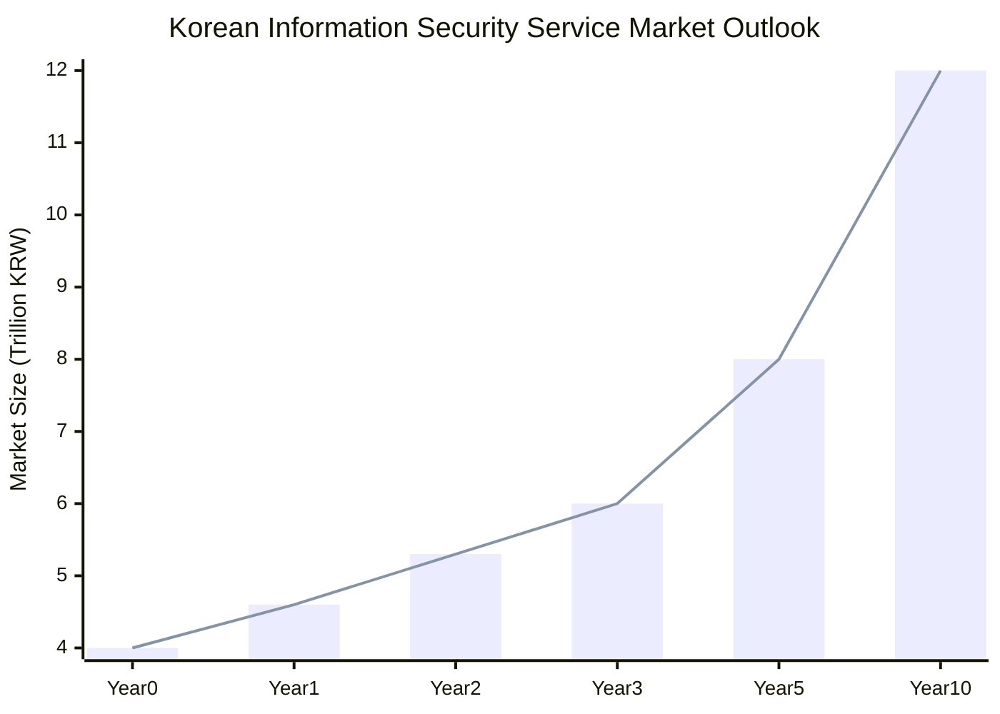

## Market Growth Forcast
한국 정보보안 서비스 시장 규모 및 클라우드 SaaS 전환에 따른 시장 성장 예측

---

**1. 서론**

현재 한국의 정보보안 서비스는 대기업과 공공 기관, 지자체, 정부를 중심으로 운영되고 있어 시장 성장에 한계를 보이고 있습니다. 시장을 더욱 확대하기 위해서는 온프레미스 장비 중심의 구조에서 클라우드 기반의 SaaS(Software as a Service)로 전환하여 중소기업도 쉽게 활용할 수 있도록 해야 합니다.

---

**2. 현재 시장 규모**

- **전체 정보보안 시장 규모**: 한국의 정보보안 시장은 2020년 기준 약 **10조 원** 규모로 추정됩니다.
- **서비스 분야 규모**: 이 중 정보보안 서비스 분야는 약 **4조 원**을 차지하고 있습니다.
- **주요 고객군**: 대기업과 공공 기관이 전체 시장의 약 **80%** 이상을 구성합니다.

---

**3. 시장의 한계**

- **고비용 구조**: 온프레미스 장비 도입에 따른 초기 투자 비용이 높아 중소기업의 접근이 어렵습니다.
- **유지보수의 복잡성**: 전문 인력이 부족한 중소기업은 시스템 유지보수에 어려움을 겪습니다.
- **유연성 부족**: 빠르게 변화하는 보안 위협에 신속히 대응하기 어려운 구조입니다.

---

**4. 클라우드 SaaS 전환의 필요성**

- **비용 효율성**: 초기 투자 비용이 적고 사용량 기반의 과금 체계로 중소기업의 부담을 줄일 수 있습니다.
- **확장성 및 유연성**: 필요에 따라 서비스를 확장하거나 축소할 수 있어 효율적입니다.
- **접근성 향상**: 인터넷만 연결되면 어디서든 서비스 이용이 가능하여 업무 효율성이 높아집니다.

---

**5. 시장 성장 예측**

- **중소기업의 잠재력**: 한국에는 약 **360만 개**의 중소기업이 있으며, 이는 전체 기업의 `99%`를 차지합니다.
- **클라우드 보안 시장 성장률**: 글로벌 추세에 따르면 클라우드 보안 시장은 연평균 `15%` 이상의 성장률을 보이고 있습니다.
- **예상 시장 규모 증가**:
    - **현재 대비 5년 후**: 중소기업의 참여로 시장 규모가 `50%` 이상 성장하여 약 **6조 원**에 이를 것으로 예상됩니다.
    - **장기 전망**: 10년 내로 시장 규모가 **두 배** 이상 성장할 가능성도 있습니다.

---

---

**6. 결론**

클라우드 SaaS로의 전환은 중소기업의 정보보안 서비스 도입을 촉진하여 전체 시장 규모를 크게 확대할 것입니다. 이는 정보보안 산업의 새로운 성장 동력이 될 뿐만 아니라 국가 전체의 사이버 보안 역량 강화에도 기여할 것으로 기대됩니다.

---

## CACO Analysis Report
한국 정보보안 서비스 시장의 클라우드 SaaS 전환과 중소기업 참여 확대

---

### **1. 현황 (Current Situation)**

- **시장 집중도**: 한국의 정보보안 서비스 시장은 주로 대기업, 공공 기관, 지자체, 정부 등을 중심으로 형성되어 있습니다.
- **온프레미스 중심**: 현재 대부분의 보안 솔루션은 온프레미스 장비를 기반으로 제공되며, 이는 높은 초기 투자 비용과 유지보수 비용을 수반합니다.
- **중소기업의 참여 저조**: 중소기업은 비용 및 전문 인력 부족으로 인해 정보보안 서비스 도입에 어려움을 겪고 있습니다.
- **시장 한계 도달**: 이러한 구조로 인해 시장 성장에 한계가 나타나고 있으며, 새로운 돌파구가 필요한 상황입니다.

---

### **2. 분석 (Analysis)**

- **비용 부담**: 온프레미스 장비의 높은 비용은 중소기업이 정보보안 서비스를 도입하는 데 큰 장벽으로 작용합니다.
- **클라우드 SaaS의 필요성**:
    - **비용 효율성**: 초기 투자 없이 사용량 기반 과금으로 비용 부담 완화
    - **접근성 향상**: 장소와 시간에 구애받지 않는 서비스 이용 가능
    - **유지보수 편의성**: 전문 인력 없이도 최신 보안 업데이트 자동 적용
- **시장 확대 잠재력**: 중소기업은 한국 기업의 약 99%를 차지하며, 이들의 참여는 시장 규모를 크게 확대할 수 있는 잠재력이 있습니다.
- **글로벌 트렌드**: 전 세계적으로 클라우드 기반의 보안 서비스 수요가 증가하고 있으며, 한국도 이러한 흐름에 동참할 필요가 있습니다.

---

### **3. 결론 (Conclusion)**

- **전환의 필요성**: 온프레미스에서 클라우드 SaaS로의 전환은 시장의 한계를 극복하고 새로운 성장 동력을 확보하는 데 필수적입니다.
- **중소기업 참여 촉진**: 클라우드 SaaS 도입을 통해 중소기업의 정보보안 서비스 접근성을 높이고, 시장 참여를 유도해야 합니다.
- **경쟁력 강화**: 클라우드 기반 서비스는 빠르게 변화하는 보안 위협에 신속하게 대응할 수 있어 전체 산업의 경쟁력을 강화할 것입니다.

---

### **4. 전망 (Outlook)**

- **시장 규모 성장**:
    - **단기 전망 (1~3년)**: 클라우드 SaaS 도입으로 시장 규모가 연평균 15% 이상 성장하여 약 6조 원에 이를 것으로 예상됩니다.
    - **중장기 전망 (5~10년)**: 중소기업의 적극적인 참여로 시장 규모가 두 배 이상 성장할 가능성이 있습니다.
- **산업 파급 효과**:
    - **일자리 창출**: 신규 서비스 개발 및 운영으로 인한 전문 인력 수요 증가
    - **기술 혁신 촉진**: 클라우드 기술 발전과 함께 보안 기술 혁신 가속화
- **국가 사이버 보안 역량 강화**: 전반적인 보안 수준 향상으로 국가 차원의 사이버 보안 위험 감소

---

## Forcast
10년 동안 매년 15%씩 시장이 성장한다고 가정하면, 연평균 성장률을 반영하여 기존 온프레미스와 클라우드 SaaS 시장이 어떻게 변화할지를 예측할 수 있습니다.

이를 반영한 계산은 다음과 같습니다:

### 1. 현재 시장 규모 (4조 원)
현재 정보보안 시장 규모가 4조 원에서 시작하여 연평균 15% 성장을 지속하면, 10년 후에 전체 시장은 약 12조 원에 도달할 것입니다.

Projected Market Size:
\[
\text{Projected Market Size} = \text{Current Market Size} \times (1 + 0.15)^{10} \approx 4 \times 4.0456 = 12.137 \text{ trillion KRW}
\]

### 2. 온프레미스와 클라우드 SaaS 비율 예측
현재 8조 원 규모의 온프레미스 시장과 클라우드 SaaS 시장으로 전환될 중소기업 수요를 반영하여, 시장의 구성 비율을 다음과 같이 가정합니다.

- **온프레미스 유지**: 현재 8조 원 중 약 **50%** 정도가 10년 후에도 온프레미스 형태로 남아있어, 최종 온프레미스 시장은 약 **4.8조 원**으로 유지될 것입니다.
- **온프레미스에서 클라우드 SaaS로 전환**: 기존 온프레미스 시장의 나머지 **50%**가 클라우드 SaaS로 전환되어 최종적으로 약 **4조 원**이 SaaS 시장으로 이동합니다.
- **중소기업 신규 클라우드 SaaS 수요**: 중소기업의 새로운 클라우드 SaaS 수요로 **4조 원**이 추가됩니다.

### 3. 최종 시장 예측 (12조 원 도달 시)

| 구분                   | 최종 시장 규모 (조 원) | 비고                                           |
|----------------------|-----------------|------------------------------------------------|
| 온프레미스 시장        | 4.8             | 기존 대기업 및 공공기관 일부 유지                |
| 기존 온프레미스 → SaaS | 4               | 기존 온프레미스 수요 중 SaaS로 전환된 부분         |
| 중소기업 신규 SaaS 수요 | 4               | 중소기업의 새로운 클라우드 SaaS 수요             |
| **총합**               | **12**          | **10년 후 예상 시장 규모 (연평균 15% 성장 반영)** |

따라서 10년 후 예상 시장 규모는 **온프레미스 4.8조 원, 클라우드 SaaS 7.2조 원 (기존 전환 + 신규 수요 포함)**으로, 총 **12조 원**이 될 것으로 예측할 수 있습니다.
