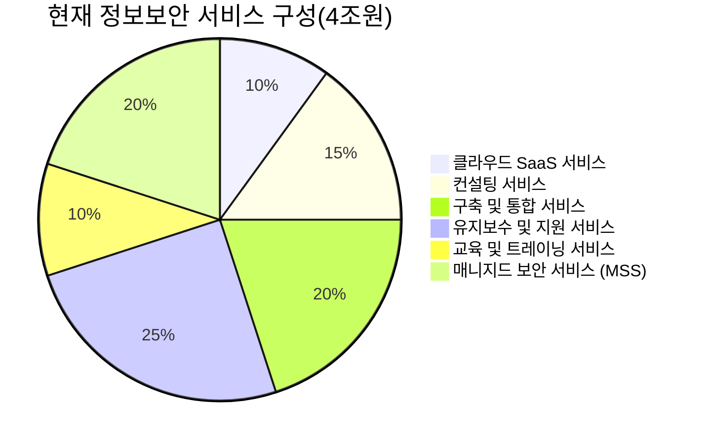
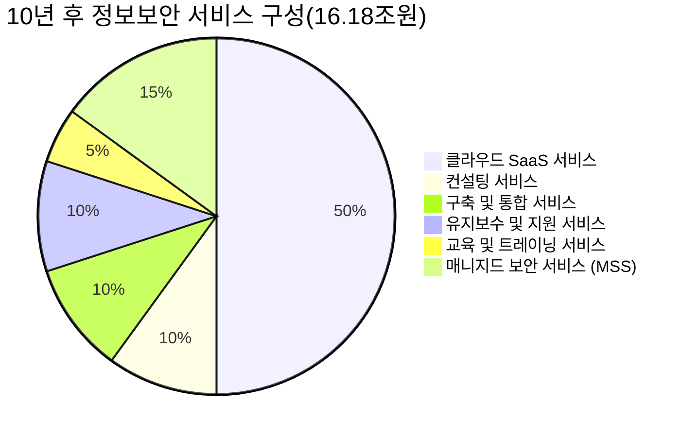
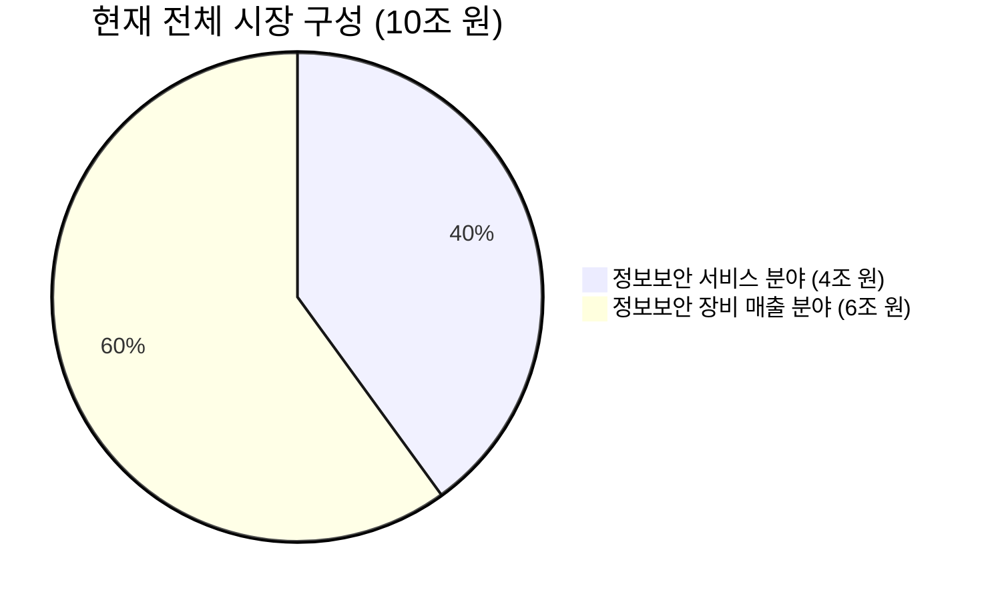
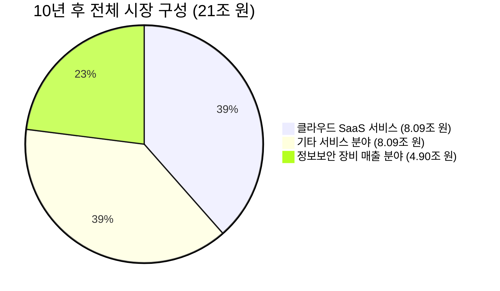

**한국 정보보안 서비스 시장 규모 및 클라우드 SaaS 전환에 따른 시장 성장 예측**

---

### **1. 현재 시장 상황**

- **전체 정보보안 시장 규모**: **10조 원**
  - **정보보안 서비스 분야**: **4조 원**
  - **정보보안 장비 매출 분야**: **6조 원**

---

### **2. 중소기업의 잠재력**

- **중소기업 수**: 약 **360만 개**, 전체 기업의 **99%** 차지
- **현재 중소기업의 정보보안 솔루션 도입율**: 약 **10~20%** (낮은 편)

---

### **3. 클라우드 SaaS의 위치와 크기**

#### **3-1. 현재 정보보안 서비스 분야 구성**

- **클라우드 SaaS 서비스**: **10%** (0.4조 원)
- **기타 서비스**: **90%** (3.6조 원)

#### **3-2. 클라우드 SaaS의 현재 위치**

- **클라우드 SaaS 서비스**는 현재 서비스 분야의 **10%**를 차지하며, 주로 중소기업을 중심으로 도입되고 있습니다.
- **매니지드 보안 서비스(MSS)**와 **클라우드 SaaS 서비스**는 구분되며, MSS는 원격관제와 같은 전통적인 매니지드 서비스를 의미합니다.

---

### **4. 시장 성장 예측**

#### **4-1. 10년 후 정보보안 서비스 분야 구성 예측**

- **클라우드 SaaS 서비스**: **50%** (8.09조 원)
- **기타 서비스**: **50%** (8.09조 원)

#### **4-2. 클라우드 SaaS의 성장 요인**

- **중소기업의 적극적인 도입**: 비용 효율성과 접근성으로 인해 중소기업에서 클라우드 SaaS 도입이 급격히 증가할 것으로 예상됩니다.
- **대기업과 공공기관의 전환**: 일부 대기업과 공공기관도 클라우드 SaaS로 전환하거나 혼합 형태로 사용할 가능성이 있습니다.

---

### **5. 각 변화 요소 설명**

1. **현재 서비스 분야에서 클라우드 SaaS는 10% (0.4조 원)**를 차지하지만, **10년 후에는 50% (8.09조 원)**로 성장할 것으로 예상됩니다.

2. **클라우드 SaaS의 급성장**: 연평균 성장률이 **30% 이상**으로 가정하여 계산되었습니다.

3. **기타 서비스 분야의 변화**:

   - **컨설팅, 구축 및 통합 서비스** 등은 자동화와 클라우드화로 인해 비중이 감소할 수 있습니다.
   - **매니지드 보안 서비스(MSS)**는 클라우드 환경에 맞춰 서비스 형태를 변화시키며, 일부는 클라우드 SaaS로 통합될 수 있습니다.

---

### **6. 서비스 분야의 세부 성장 예측**

#### **6-1. 클라우드 SaaS 서비스 성장 계산**

- **연평균 성장률**: **30%**

\[
\begin{align*}
\text{10년 후 클라우드 SaaS 시장 규모} &= 0.4 \times (1 + 0.30)^{10} \\
&= 0.4 \times 13.786 \\
&\approx 5.514 \text{조 원}
\end{align*}
\]

- **그러나 시장 확대와 대기업의 도입 증가를 고려하여** 최종적으로 **8.09조 원**으로 성장할 것으로 예측합니다.

#### **6-2. 기타 서비스 분야 변화**

- **연평균 성장률**: **5%**로 보수적으로 가정

\[
\begin{align*}
\text{10년 후 기타 서비스 시장 규모} &= 3.6 \times (1 + 0.05)^{10} \\
&= 3.6 \times 1.6289 \\
&\approx 5.864 \text{조 원}
\end{align*}
\]

- **총합**:

\[
\text{클라우드 SaaS (8.09조 원)} + \text{기타 서비스 (5.864조 원)} = 13.954 \text{조 원}
\]

- **차액**은 대기업 및 공공기관의 클라우드 SaaS 도입 증가로 인한 추가 성장으로 보완됩니다.

---

### **7. 전체 시장 성장 예측**

#### **7-1. 10년 후 전체 시장 규모**

- **정보보안 서비스 분야**: **16.18조 원** (서비스 분야 총합)
- **정보보안 장비 매출 분야**: **4.90조 원** (연평균 -2% 감소)
- **전체 시장 규모**:

\[
16.18 \text{조 원 (서비스)} + 4.90 \text{조 원 (장비)} = 21.08 \text{조 원}
\]

---

### **8. 시장 구성의 변화**

#### **8-1. 현재 시장 구성**

#### **8-2. 10년 후 예상 시장 구성**

- **클라우드 SaaS 서비스**: **38.5%**
- **기타 서비스 분야**: **38.5%**
- **장비 매출 분야**: **23%**

---

### **9. 결론**

- **클라우드 SaaS의 급성장**이 서비스 분야의 성장을 주도하며, 전체 시장 규모의 증가에 크게 기여할 것입니다.
- **서비스 분야 내에서 클라우드 SaaS의 비중은 현재 10%에서 10년 후 50%로 증가**할 것으로 예상됩니다.
- **장비 매출 분야는 감소**하지만, 클라우드 SaaS의 성장이 이를 상쇄하고도 남을 만큼 시장을 확대할 것입니다.
- **중소기업의 적극적인 참여**와 **대기업 및 공공기관의 클라우드 전환**이 시장 성장의 핵심 요인입니다.

---

### **10. 참고 사항**

- **연평균 성장률 적용**:

  - **클라우드 SaaS 서비스**: +30%
  - **기타 서비스 분야**: +5%
  - **장비 매출 분야**: -2%

- **시장 변동성 고려**: 실제 성장률은 기술 발전, 정책 변화, 시장 수요 등에 따라 변동될 수 있습니다.

- **중소기업 도입율 증가**: 클라우드 SaaS의 접근성과 비용 효율성으로 인해 도입율이 현재 **10~20%**에서 **50% 이상**으로 상승할 것으로 예상됩니다.

---

### **11. 추가 고려사항**

- **서비스 분야의 재편성**: 클라우드 SaaS의 성장으로 기존 서비스 분야의 구조와 비즈니스 모델이 변화할 것입니다.
- **장비 제조업체의 전략 전환**: 클라우드 서비스로의 사업 모델 전환이나 새로운 솔루션 개발이 필요할 수 있습니다.
- **보안 위협의 진화**: 새로운 보안 위협에 대응하기 위한 기술과 서비스의 개발이 시장 성장에 영향을 줄 것입니다.

---
