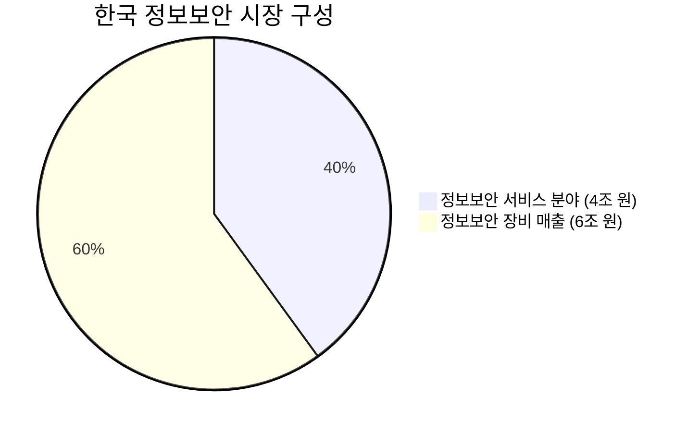
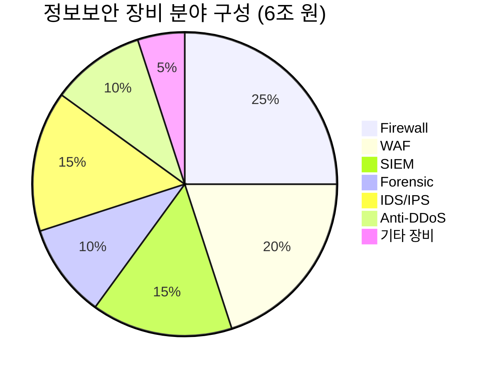
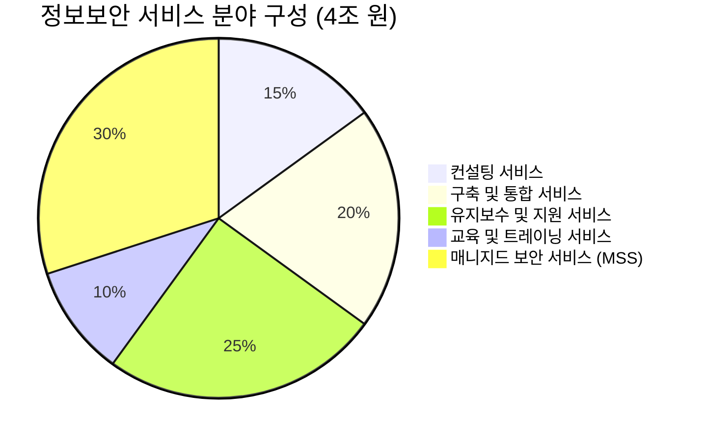

# Product Segmentation

```mermaid
pie title 한국 정보보안 시장 구성
    "정보보안 서비스 분야 (4조 원)" : 40
    "정보보안 장비 매출 (6조 원)" : 60
```

```mermaid
pie title 정보보안 장비 분야 구성 (6조 원)
    "Firewall" : 25
    "WAF" : 20
    "SIEM" : 15
    "Forensic" : 10
    "IDS/IPS" : 15
    "Anti-DDoS" : 10
    "기타 장비" : 5
```

```mermaid
pie title 정보보안 서비스 분야 구성 (4조 원)
    "컨설팅 서비스" : 15
    "구축 및 통합 서비스" : 20
    "유지보수 및 지원 서비스" : 25
    "교육 및 트레이닝 서비스" : 10
    "매니지드 보안 서비스 (MSS)" : 30
```
