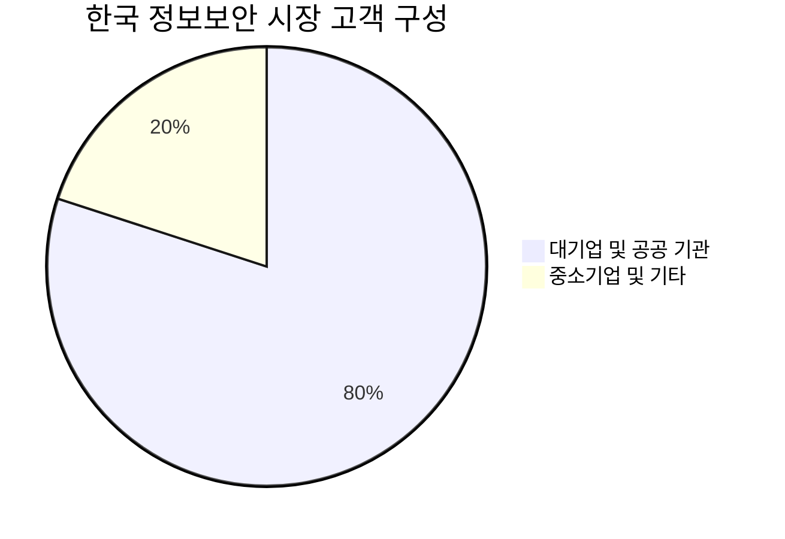
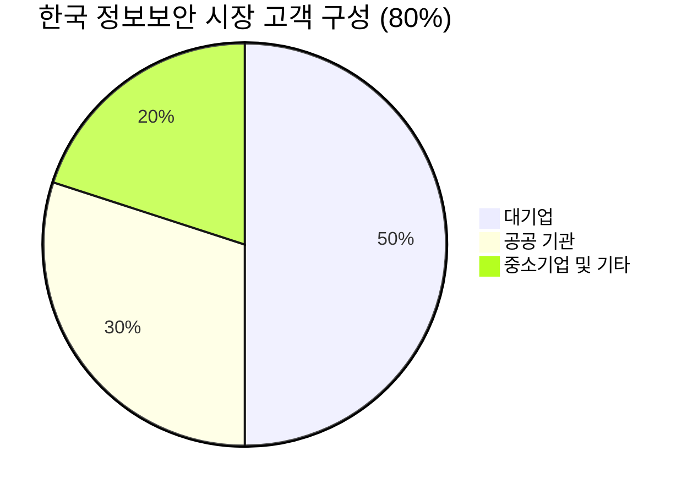
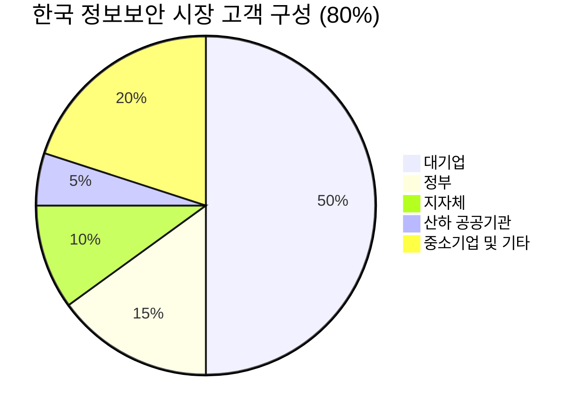

## Customer Segmentation


```mermaid
pie title 한국 정보보안 시장 고객 구성
    "대기업 및 공공 기관" : 80
    "중소기업 및 기타" : 20
```


```mermaid
pie title 한국 정보보안 시장 고객 구성 (80%)
    "대기업" : 50
    "공공 기관" : 30
    "중소기업 및 기타" : 20
```


```mermaid
pie title 한국 정보보안 시장 고객 구성 (80%)
    "대기업" : 50
    "정부" : 15
    "지자체" : 10
    "산하 공공기관" : 5
    "중소기업 및 기타" : 20
```

```mermaid

```
